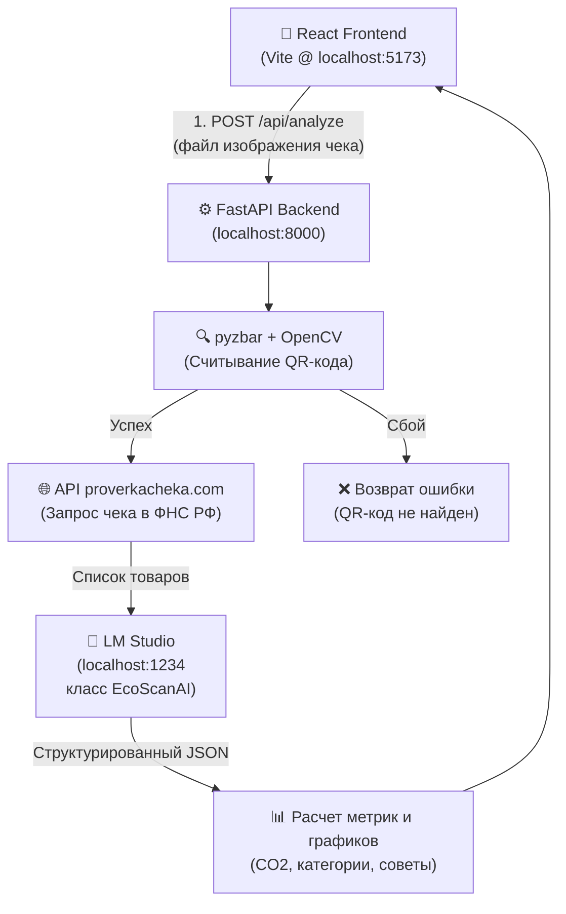

# EcoScan — Калькулятор углеродного следа магазинных чеков

**EcoScan** — это веб-приложение для мгновенного анализа экологического следа ваших покупок. Пользователь загружает фотографию чека, система считывает QR-код, запрашивает официальный список товаров из ФНС РФ и с помощью локальной большой языковой модели (LLM) классифицирует продукты, вычисляя их углеродный след ($CO_2$) и генерируя полезные эко-советы.

---

## 🏗️ Архитектура системы

Приложение разделено на фронтенд-клиент (React) и бэкенд-сервер (FastAPI), взаимодействующий с внешними API и локальной нейросетью:



---

## 📂 Структура проекта

Основная структура ключевых файлов проекта:

```text
EcoProject_Receipt_analysis/
├── backend.py            # FastAPI-сервер, роутинг, декодирование QR, интеграция с API ФНС
├── API_LM.py             # Интеграция с клиентом OpenAI (для локального LM Studio)
├── .env                  # Хранение API-токенов (в частности, PROVERKACHEKA_TOKEN)
├── requirements.txt      # Зависимости Python
├── backup_v2/            # Резервная копия стабильной версии с QR-кодами
└── frontend/             # Исходный код клиентской части (React + Vite + Tailwind v4)
    ├── index.html        # HTML-шаблон страницы с SEO-метаданными
    ├── vite.config.ts    # Конфигурация Vite (проксирование /api, allowedHosts)
    └── src/
        ├── main.tsx      # Точка входа React
        ├── styles/       # Глобальные CSS стили и дизайн-система
        └── app/
            ├── App.tsx   # Главный компонент разметки страницы
            ├── components/
                ├── Header.tsx           # Шапка сайта
                ├── Hero.tsx             # Первый экран (призыв к действию, фоновый макет)
                ├── HowItWorks.tsx       # Инструкция: как это работает
                ├── Problem.tsx          # Раздел с проблематикой углеродного следа
                ├── UploadForm.tsx       # Загрузчик чека с анимацией прогресса
                ├── ResultsDashboard.tsx # Отчёт об углеродном следе (Pie-диаграмма, таблица)
                ├── FAQ.tsx              # Вопросы и ответы (QR-коды, точность, ФНС)
                └── Contacts.tsx         # Блок контактов разработчиков
```

---

## ⚙️ Установка и настройка

### 1. Системные зависимости

Для декодирования QR-кодов (`pyzbar`) требуются системные библиотеки сканирования штрих-кодов:
* **Windows**: Устанавливаются автоматически вместе с python-библиотекой (DLL включены в пакет).
* **Linux (Ubuntu/Debian)**: Требуется установить пакет `libzbar0`:
  ```bash
  sudo apt update && sudo apt install libzbar0 -y
  ```

### 2. Конфигурация API ФНС
Сервис получает чеки через сторонний шлюз `proverkacheka.com`.
1. Зарегистрируйтесь на сайте [proverkacheka.com](https://proverkacheka.com).
2. Скопируйте ваш API-токен из раздела **Справка / Личный кабинет**.
3. Создайте файл `.env` в корневом каталоге проекта и укажите токен:
   ```env
   PROVERKACHEKA_TOKEN=ваш_токен_из_личного_кабинета
   ```

### 3. Установка зависимостей Python (Бэкенд)
Активируйте виртуальное окружение и установите библиотеки:
```bash
.venv\Scripts\activate
pip install -r requirements.txt
```

### 4. Установка зависимостей Node.js (Фронтенд)
Перейдите в папку `frontend` и установите пакеты:
```bash
cd frontend
npm install
```

---

## 🚀 Запуск проекта в режиме разработки

Для работы приложения должны быть запущены три службы одновременно:

### Шаг 1. Локальная LLM (LM Studio)
1. Откройте **LM Studio**.
2. Загрузите любую инструктивную модель среднего размера (рекомендуется `qwen2.5-14b-instruct`).
3. Запустите локальный сервер (Developer HTTP Server) на порту `1234`.

### Шаг 2. Бэкенд (FastAPI)
В корневой папке проекта запустите:
```bash
.venv\Scripts\python.exe backend.py
```
> Сервер API запустится на `http://localhost:8000`.

### Шаг 3. Фронтенд (Vite)
В папке `frontend` запустите dev-сервер:
```bash
npm run dev
```
> Сайт откроется локально по адресу `http://localhost:5173`.

---

## 🔗 Локальный доступ для коллег (Шеринг)

Поскольку в `vite.config.ts` настроена опция `allowedHosts: true`, вы можете легко пробросить сайт в интернет для тестирования коллегами:

### Через Ngrok (Рекомендуемый и стабильный вариант)
1. Установите ngrok (на Windows: `winget install Ngrok.ngrok`).
2. Привяжите ваш бесплатный токен из личного кабинета:
   ```bash
   ngrok config add-authtoken <ВАШ_ТОКЕН>
   ```
3. Запустите туннель:
   ```bash
   ngrok http 5173
   ```
4. Отправьте сгенерированную ссылку вида `https://xxxx-xx-xx.ngrok-free.app` коллегам. При первом переходе им нужно будет нажать **«Visit Site»**.

---

## 🌐 Деплой на постоянный сервер (Production)

При публикации приложения в глобальный интернет:

1. **Замена LLM на облачную**: Поскольку локальный ПК с LM Studio будет выключен, замените API-эндпоинт в `API_LM.py` на облачный (например, дешевый и быстрый **DeepSeek API**):
   ```python
   self.client = OpenAI(
       base_url="https://api.deepseek.com/v1",
       api_key="ваш_api_ключ_deepseek"
   )
   ```
2. **Сборка фронтенда**: Скомпилируйте файлы фронтенда:
   ```bash
   cd frontend
   npm run build
   ```
   В результате в папке `frontend/dist` будут созданы статические HTML/JS/CSS файлы, которые бэкенд на FastAPI автоматически начнет раздавать при обращении к `/`.
3. **Запуск на сервере**: Достаточно запустить `backend.py` на VPS-сервере через менеджер процессов (например, `PM2` или `systemd`) за прокси-сервером `Nginx`, настроив SSL (HTTPS).
